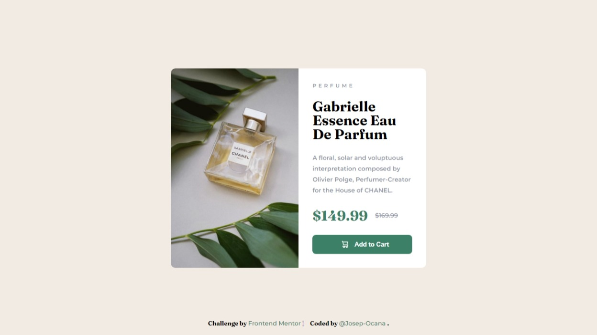
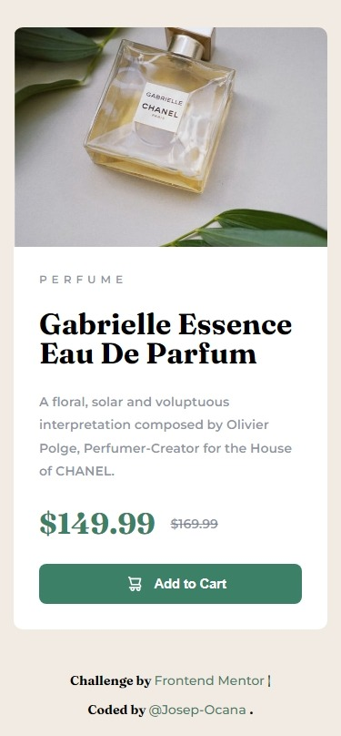

# Frontend Mentor - Product preview card component solution

This is a solution to the [Product preview card component challenge on Frontend Mentor](https://www.frontendmentor.io/challenges/product-preview-card-component-GO7UmttRfa). Frontend Mentor challenges help you improve your coding skills by building realistic projects.

## Table of contents

-   [Overview](#overview)
    -   [The challenge](#the-challenge)
    -   [Screenshot](#screenshot)
    -   [Links](#links)
-   [My process](#my-process)
    -   [Built with](#built-with)
    -   [What I learned](#what-i-learned)
-   [Author](#author)
-   [Acknowledgments](#acknowledgments)

## Overview

### The challenge

Users should be able to:

-   View the optimal layout depending on their device's screen size
-   See hover and focus states for interactive elements

### Screenshot

#### Desktop

#### Mobile design

### Links

-   Solution URL: [@Josep-Ocana-product-preview-card](https://github.com/Josep-Ocana/FM-product-preview-card)
-   Live Site URL: [@Josep-Ocana-product-preview-card](https://from-product-preview-card.netlify.app/)

## My process

### Built with

-   Semantic HTML5 markup
-   Flexbox
-   [Next.js](https://nextjs.org/) - React framework
-   [SASS](https://sass-lang.com/) - For styles.
-   Webpack

### What I learned

In this project, I still learning SASS working on it.
I am learning working with Webpack and doing deployments in [Netlify](https://www.netlify.com/)

## Author

-   Frontend Mentor - [@Josep-Ocana](https://www.frontendmentor.io/profile/Josep-Ocana)

## Acknowledgments

-   I would like to thank frontend mentor for doing these exercises that help us to improve and refine our code.

-   I would also like to thank my family for motivating me and for his support.😘
